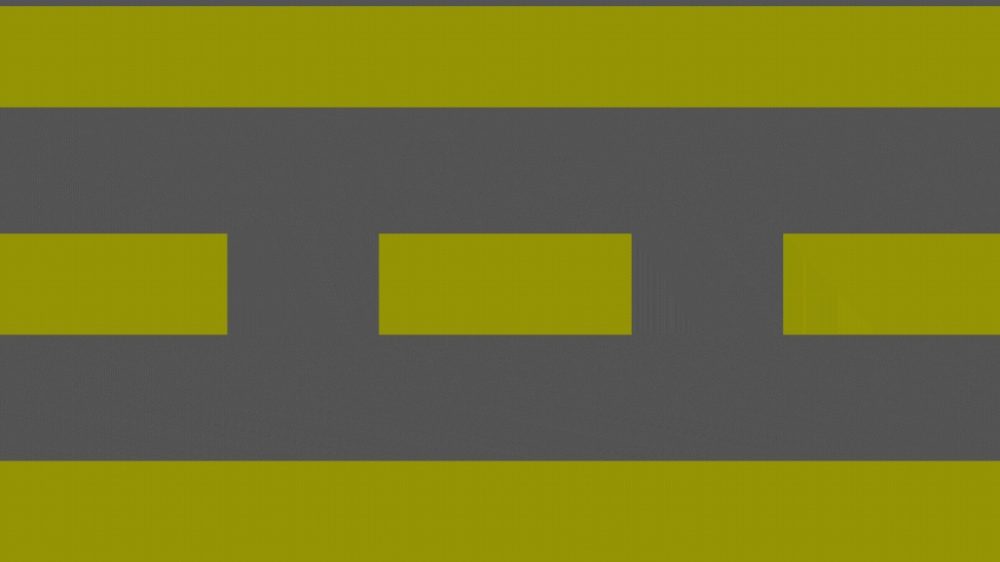

<h2 align="center">Olá bem vindo!!🚀👨‍💻 Meu nome é Waldemar Leonardo e sou desenvolvedor Front-End!</h2>

###

  
  
  

<h3 align="center">💻 Tecnologias que mais utilizo</h3>

  
  
  
  
  
  
  
  
  
  
  
  
  
  
  

  
  
  
  
  
  
  
  
  
  
  

<h3 align="center">📱 Minha rede social</h3>

  

 

  

